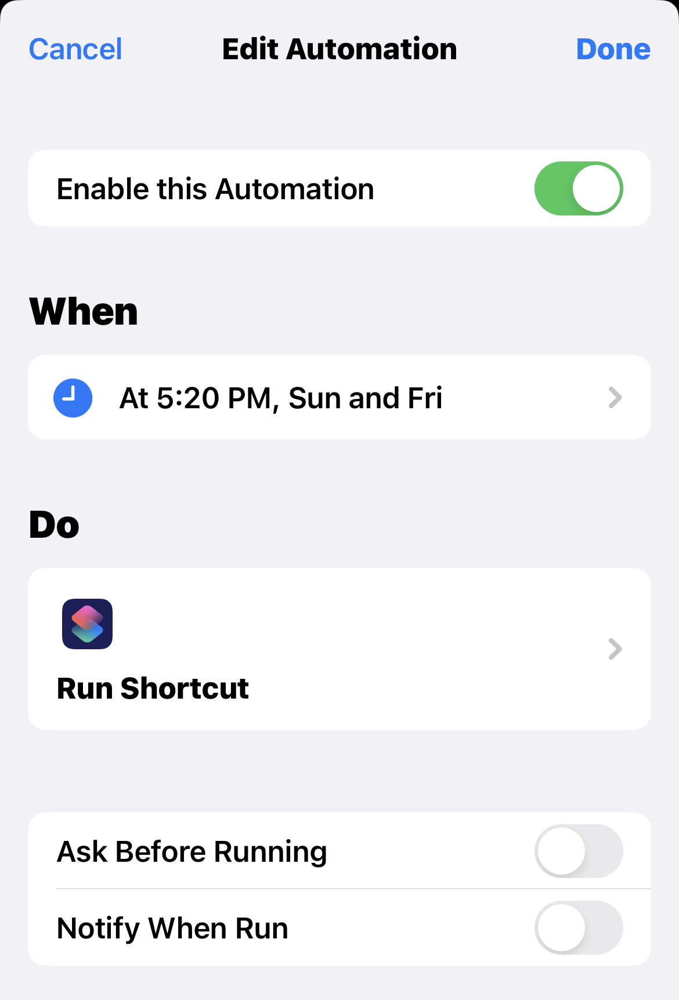
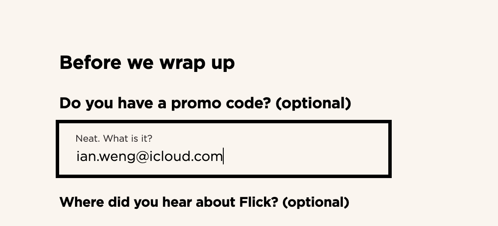

# Flick Electric Plan Switcher

## Original idea

For any [Flick electic](https://www.flickelectric.co.nz) **FLAT** plan user, 
there is a guaranteed saving by using **OFF PEAK** plan for weekends.

For example, as a lower user in Aukcland, this strategy helps me pay 24.14c/kwh (flat price) for weekdays and 21.30c/kwh (off peak price) for weekends. Note: prices are as of Sept 2023 and include GST.

Switch between **FLAT** and **OFF PEAK** plans can be done via the Flick app/website. However, switching twice a week is repetitive and inconvenient.

With an API built, swithcing can be fully automated.

## iOS Automation

### Create a shortcut 

Open Shortcuts app, create a shortcut with the following steps:

Step 1: Get contents of URL `https://xqpxlc6rrbl2uewlfqny5yqvpi0dxqxl.lambda-url.ap-southeast-2.on.aws` (recommended), or `https://flick-electric-plan-switcher.onrender.com`
- Set `Method` to `POST`
- Set `Request Body` to `JSON`
- Set `email`, `password` and `plan`

Step 2: Show notificaiton of step 1 content
- Set `Type` to `Text`

### Verfiy the shortcut

Run shortcut manually. For successful run, a notification would show in less a minute.

### Schedule run

Create a automation like the following that runs the shortcut at **random time of your choice*** on **Friday** and **Sunday**. 

* is important so that not everyone would be changing at that same time which could overload the API. If you are struggled to pick a time, try [this](https://www.randomlists.com/random-time?dup=false&qty=1&time2=23%3A00&time1=01%3A00)

## Different ideas

If you have different ideas of how you would like to switch, the following are possible values can be used to set `plan` via the API:
* `superflat`: 
  * switch to **OFF PEAK** plan if the current weekday is **Friday** or **Saturday** 
  * otherwise **FLAT** plan
* `flat`: switch to **FLAT** plan
* `off_peak`: switch to **OFF PEAK** plan

Note: Flick allows switch plan as often as you like, but switch only effects after midnight.

## Hosting

### Platform
The API service is hosted in [AWS](http://aws.amazon.com) and [render.com](https://render.com) (using free tier). 

#### Limtation
Due to free tier, the resource is limtied and API could be slow.

### Secruity
The secruity is managed by the hosting platform. And `password` is not stored.

### Disclaimer
This service is provided without warranty and may be discontinued or modified at my discretion. I am not liable for any loss of data, interruptions, or third-party actions. Use of this service is at your own risk. I am not responsible for the accuracy or completeness of information provided. This is not professional advice. By using this service, you agree to these terms.

### Need more control
You are welcome to modify the code and host the service yourself.

## Friend Get Friend

If you would like to join Flick and support this project, please use `ian.weng@icloud.com` as `promo code`. [Friend Get Friend](https://www.flickelectric.co.nz/friend-get-friend/) would give each of us $50 credits.

## Contact

Feel free to raise GitHub issues or contact me via `ian.weng@icloud.com`.
