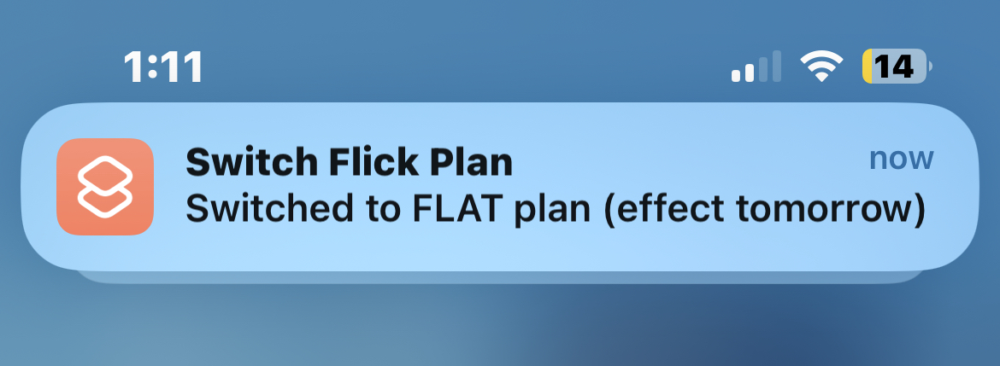

# Flick Electric Plan Switcher

## Original idea

For any [Flick Electic](https://www.flickelectric.co.nz) **FLAT** plan user, 
there is a guaranteed saving by using **OFF PEAK** plan for weekends.

For example, as a lower user in Aukcland, this strategy helps me pay 24.14c/kwh (flat price) for weekdays and 21.30c/kwh (off peak price) for weekends. Note: prices are as of Sept 2023 and include GST.

Switch between **FLAT** and **OFF PEAK** plans can be done via the Flick app/website. However, switching twice a week is repetitive and inconvenient.

With an API built, swithcing can be fully automated.

## iOS Automation

### Create a shortcut 

Open Shortcuts app, create a shortcut with the following steps:

1. Add the shortcut using the following link: [icloud.com/shortcuts/f9b6ba104343461fba7b94eb009d07fe](https://www.icloud.com/shortcuts/f9b6ba104343461fba7b94eb009d07fe)
2. Modify `email` and `password`

### Verfiy the shortcut

Run shortcut manually. For successful run, a notification would show in less a minute.

### Schedule run

Create a automation like the following that runs the shortcut on **Friday** and **Sunday**. 

## Different ideas

If you have different ideas of how you would like to switch, the following are possible values can be used to set `plan` via the API:
* `superflat`: 
  * switch to **OFF PEAK** plan if the current weekday is **Friday** or **Saturday** 
  * otherwise **FLAT** plan
* `flat`: switch to **FLAT** plan
* `off_peak`: switch to **OFF PEAK** plan

Note: Flick allows switch plan as often as you like, but switch only effects after midnight.

## Hosting

### Platform
The API is hosted in [AWS](http://aws.amazon.com) (using free tier). 

#### Limtation
Due to free tier, the API could be slow due to limited resources.

### Secruity
The secruity is managed by the hosting platform. And `password` is not stored/logged.

### Disclaimer
This service is provided without warranty and may be discontinued or modified at my discretion. I am not liable for any loss of data, interruptions, or third-party actions. Use of this service is at your own risk. I am not responsible for the accuracy or completeness of information provided. This is not professional advice. By using this service, you agree to these terms.

## Friend Get Friend

Use the following link to join Flick. Both of us will receive a power credit!

[flickelectric.co.nz/refer/xweng1](http://flickelectric.co.nz/refer/xweng1)

## Contact

ian.weng@icloud.com
